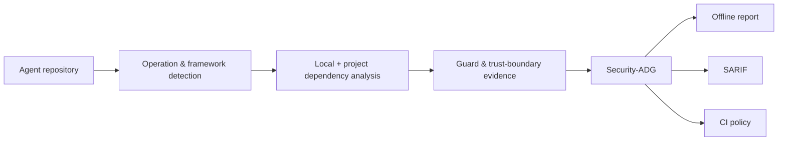

<div align="center">

# AgentSecBench

### Trace agent-controlled input to security-sensitive effects.

Read-only static analysis and explainable Security-ADGs for LLM-agent code.

[](https://github.com/A1LinLin1/AgentSecBench/actions/workflows/security-adg-artifacts.yml)
[](https://arxiv.org/abs/2610.03014)


[](LICENSE)

[Quick start](#quick-start) · [How it works](#how-it-works) · [GitHub Action](#github-action) · [Paper](#paper) · [Documentation](#documentation)

</div>

> [!IMPORTANT]
> AgentSecBench finds **review candidates**, not automatic vulnerabilities.
> It never imports or executes the analyzed project, installs its dependencies,
> or contacts external services.


## See the path—not just the sink

| Discover | Explain | Enforce |
|---|---|---|
| Find shells, file operations, interpreters, browsers, network calls, credentials, and agent tools. | Connect agent-facing sources, call paths, trust boundaries, guards, operations, and potential effects. | Export SARIF, baseline existing findings, audit suppressions, and block only new policy matches in CI. |

AgentSecBench combines a conventional candidate scanner with a candidate-centered
**Security-Aware Agent Dependency Graph (Security-ADG)**. Every relation retains
source provenance and distinguishes structural evidence from inferred context.

## Quick start

Install the latest release and generate a complete offline report from the
built-in authored demo:

```bash
python -m pip install https://github.com/A1LinLin1/AgentSecBench/releases/download/v0.2.0/agentsecbench-0.2.0-py3-none-any.whl
agentsecbench doctor
agentsecbench demo --output agentsecbench-demo
```

Open `agentsecbench-demo/results/report/index.html`, then scan a real local
repository:

```bash
agentsecbench analyze /path/to/your-agent --output agentsecbench-results
```

```powershell
agentsecbench analyze H:\projects\my-agent --output agentsecbench-results
Start-Process agentsecbench-results\report\index.html
```

No corpus manifest or project configuration is required for the first scan.

## What one scan produces

| Artifact | Use it for |
|---|---|
| `report/index.html` | Offline visual investigation, graph comparison, notes, and review export |
| `findings.jsonl` | Stable candidate records for automation |
| `security-adg.jsonl` | Typed evidence graphs with provenance |
| `framework-coverage.json` | Modeled, signal-only, and generic-analysis coverage diagnostics |
| `results.sarif` | GitHub code scanning and compatible IDEs |
| `summary.json` | Run-level metrics and output locations |
| `policy.json` / `policy-summary.md` | New, existing, suppressed, and blocking CI results |

All primary machine-readable outputs have bundled, versioned JSON Schemas.

## How it works



The analyzer follows bounded direct calls and imports across Python and
JavaScript/TypeScript files. Dynamic dispatch, reflection, aliases, and inferred
boundaries remain visible limitations instead of being silently upgraded to facts.

## Framework-aware, not framework-locked

Built-in adapters recognize common entrypoint idioms from:

`MCP / FastMCP` · `LangChain` · `CrewAI` · `AutoGen` · `OpenAI Agents SDK` · `Semantic Kernel` · `LlamaIndex`

Custom adapters can be declared in `.agentsecbench.toml`. Every scan now reports:

- **modeled** — framework evidence reached at least one candidate graph;
- **signal only** — framework text was observed but semantic evidence was not attached;
- **not observed** — the adapter had no signal in scanned files; and
- **generic candidate files** — candidates were analyzed without framework context.

This diagnostic is a coverage aid, not a claim of complete framework support.
See [Framework coverage](docs/FRAMEWORK_COVERAGE.md).

## GitHub Action

```yaml
name: Agent security review
on: [push, pull_request]

permissions:
  contents: read

jobs:
  agentsecbench:
    runs-on: ubuntu-latest
    steps:
      - uses: actions/checkout@v4
      - uses: A1LinLin1/AgentSecBench@v0.2.0
        with:
          path: .
          output: agentsecbench-results
          fail-on-new: "true"
      - uses: actions/upload-artifact@v4
        if: always()
        with:
          name: agentsecbench-results
          path: agentsecbench-results
```

Start with a baseline so CI can focus on newly introduced candidates. Policy
filters never remove records from the report, JSONL, graph, or SARIF outputs.

## Paper

AgentSecBench and Security-ADG are described in:

> Hang Cui. **Beyond Predefined Sinks: Security-Aware Dependency Analysis for
> LLM Agents.** arXiv:2610.03014, 2026.
> [Paper](https://arxiv.org/abs/2610.03014) ·
> [PDF](https://arxiv.org/pdf/2610.03014) ·
> [DOI](https://doi.org/10.48550/arXiv.2610.03014)

<details>
<summary>BibTeX</summary>

```bibtex
@article{cui2026beyond,
  title   = {Beyond Predefined Sinks: Security-Aware Dependency Analysis for LLM Agents},
  author  = {Cui, Hang},
  journal = {arXiv preprint arXiv:2610.03014},
  year    = {2026},
  doi     = {10.48550/arXiv.2610.03014},
  url     = {https://arxiv.org/abs/2610.03014}
}
```

</details>

GitHub also exposes this citation through [CITATION.cff](CITATION.cff).

## Research-backed engineering

The analyzer grew from a frozen real-world study rather than a toy rule set.

| Frozen study asset | Scale |
|---|---:|
| LLM-agent repositories | 67 |
| Agent ecosystems | 11 |
| Source files | 37,542 |
| Reproduction-confirmed security behaviors | 22 |

The public repository contains the implementation, deterministic fixtures, and
reproduction protocols. Third-party repository snapshots, credentials, raw
participant/model outputs, and coordinated disclosure material are not published.

## Documentation

| Goal | Guide |
|---|---|
| Install, configure, scan, triage, and adopt CI | [User guide](docs/USER_GUIDE.md) |
| Interpret framework support and extend adapters | [Framework coverage](docs/FRAMEWORK_COVERAGE.md) |
| Consume versioned machine-readable outputs | [Schema compatibility](docs/OUTPUT_SCHEMA_COMPATIBILITY.md) |
| Understand baseline and suppression matching | [Baseline matching policy](docs/BASELINE_MATCHING_POLICY.md) |
| Run the full research artifact pipeline | [Security-ADG pipeline](docs/SECURITY_ADG_PIPELINE.md) |
| Track engineering priorities | [Product roadmap](docs/PRODUCT_ROADMAP.md) |
| Report a vulnerability in AgentSecBench | [Security policy](SECURITY.md) |

## Status

AgentSecBench is an engineering preview. Output schemas are versioned
independently from the package, and CI covers the CLI, graph construction,
framework diagnostics, offline report, policy workflow, and release artifacts.

Contributions are welcome under the [Apache-2.0 license](LICENSE). See
[CONTRIBUTING.md](CONTRIBUTING.md) before proposing a new rule or framework adapter.
